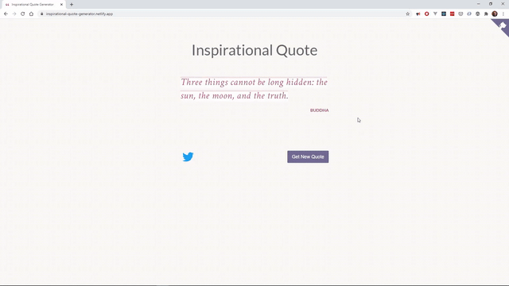

# Inspirational Quote Generator

Since I'm currently learning React, I decided to start working on the "Build a Random Quote Machine" project part of the [Front End Libraries Projects](https://www.freecodecamp.org/learn/front-end-libraries/front-end-libraries-projects/build-a-random-quote-machine) from freeCodeCamp.

### Installation

1. Clone the repository: `https://github.com/alexandracaulea/inspirational-quote-generator`.
2. Install project dependencies by running: `yarn install`.

### Using this repo

1. For the development run: `yarn start`.
2. To build run `yarn build`.
3. To run tests: `yarn test`.
4. To build: `yarn build`.
5. To eject `yarn eject`

### Live Example

[Live example on Netlify](https://inspirational-quote-generator.netlify.app/)

